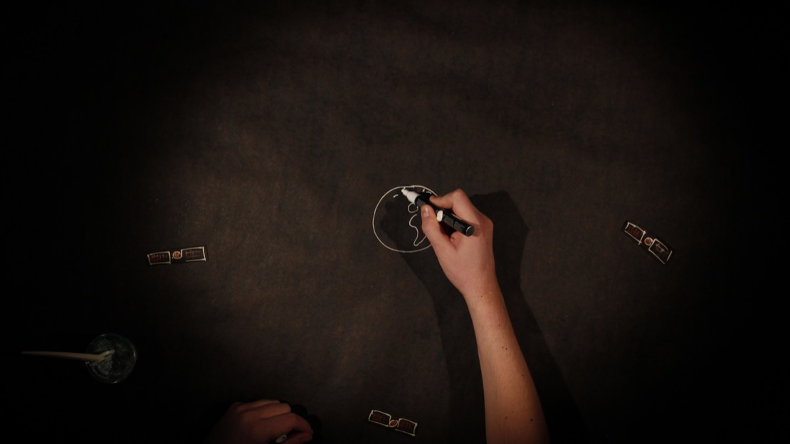

[leena@animaatiokopla.fi](mailto:leena@animaatiokopla.fi)

+358 50 547 9775

Media Art by

# LEENA JÄÄSKELÄINEN

## Out Of Body Experience

*Out of Body Experience* is an art work to be experienced in a virtual
reality environment. It combines interviews about body image to an
abstract, dreamlike landscape created in a 3D-program. The result is
intimate, atmospheric and meditational. In virtual reality, one doesn\'t
in a sense have a body. *Out of Body Experience* utilizes this feeling
of detachment.

## Blue sky on Mars

Scientist Sini Merikallio talks about science fiction in the
experimental documentary *Blue sky on Mars.*

The basis for this film was the curiosity about scientists\' view on
science fiction. What do people, who invent electric solar wind sails, use
satellites to measure Earths gravitational field, monitor marine
environment using 500 000 observations per day, or design greenhouses on
Mars, think about science fiction? *Blue sky on Mars* invited four scientists from different fields to talk
about science fiction. And not just talk, to also create experimental
animation art inspired by it. Various animation techniques were used in
a series of workshops. Stop motion was filmed at the roof of the
Meteorological Institute, and in the Helsinki zoo, cut-outs were
animated in a studio, rockets were drawn with markers on transparent
plastic in a greenhouse, et cetera. The results were pretty amazing. It
turned out that the scientific mind is also very adept in creating
animation!

Of the four parts envisioned, one is completed so far. The rest remain
in pre-production for the time being.

Participating scientists: Sini Merikallio, Olli Wilkman, Simo Siiriä,
Lauri Neuvonen.

<https://vimeo.com/249516336>

Password: blue

{: .img-fluid}

{: .img-fluid}

{: .img-fluid}

{: .img-fluid}

{: .img-fluid}

{: .img-fluid}

## Building Art History

*Building Art History* is an experimental documentary film about the
ideal body throughout history. In ancient Greece athletes were carved
out of marble, in the times of renaissance fabulous frescos were
painted, nowadays it\'s all about building one\'s own body. And posing!

*Building Art History* features five body builders posing the same way
as people in the art works of their choosing. Before going into the
shooting part of the process, there were interesting talks about ideals,
motives, society, and art. Being in the shape for contests is hard work,
and feels even painful. One of the participants wanted to concentrate on
this feeling of suffering in his part of the film, and chose the art
works accordingly. The other wanted to convey power and self assurance.
The beauty ideals now are very much the same as they were in ancient
Greece. Many of the poses of classical body building can be seen in
classical statues. The female body builders today face the similar
criticism as Michelangelo\'s female figures way back; they are labeled
ugly and masculine.

*Building Art History* was shot in the location of different gyms, to
show the participants in an environment that is natural to them, where
they spend a lot of time in.

People on the film: Eppu Saarela, Nasim Nasu Shamlou-Juhola, Moms Bah,
Bettina Gräsbeck and Hans Rohila.

<https://vimeo.com/245196217>

{: .img-fluid}

{: .img-fluid}

{: .img-fluid}

{: .img-fluid}

{: .img-fluid}

## Contact!

*Contact!* is an experimental animation film about movement and meeting.
It explores differences and similarities between dancing and martial
arts aikido and judo. The technique is hand painted digital animation.
*Contact!* was originally an installation piece, with three separate
looping parts, each projected on a tar-paper surface in a gallery. Later
the material was edited into a short film, with addition of music by
Nikolai Kleiman. The editing of the film follows the rhythm of the music
very closely, it even required some additional animation.

There is something very soothing, hypnotic even, in watching looping
movement. One gets to enjoy the fast pace, but is able to actually see
clearly what is going on.

In the heart of *Contact!* is the meeting, the interaction between two
people. In judo it seems violent, but is it really? The attack is
simulated. There is no real intent of harming the opponent. Both the
attacker and the attacked know how to move and how to fall. The
situation is safe. In the dance sequence the meeting is joyous, even
loving, eventhough the steps are well rehearsed. There is no attack, no
defense. But there is definitely a reaction! In the part with aikido the
roles of the attacker and the attacked keep changing. Both keep
themselves very soft and react to each others movement. On the surface,
this comes very close to dancing, but on the inside it is similar to
judo. Best of both worlds? It might not be just a coincidence, that both
the director and the musical composer of this film hold a black belt in
aikido!

<https://vimeo.com/214458568>

{: .img-fluid}

{: .img-fluid}

{: .img-fluid}

## In love with Amelia Earhart

*In love with Amelia Earhart* is a light-hearted short film about the
contradiction between youthful enthusiasm and mature realism. In the
film the middle-aged Erja is reunited with her two lost loves; Amelia
Earhart and herself.

In the film the historical heroine Amelia Earhart is a symbol of freedom
and courage to pursue one\'s dreams. The flip-side of a dream of flying
is the fear of falling, of course. The middle-aged version of the main
character Erja has had her share of falling, something the teenage
version of her is yet blissfully ignorant of. *In love with Amelia
Earhart* features footage of Amelia Earhart\'s last flight. The old
black and white clips were hand painted on to create a feeling of
subjectivity; the person watching these clips is Erja.

The stop motion sequences of this film were shot in the beautiful
Brinkhall mansion in the archipelago of Turku. The mansion provided
amazing details to the film; chipped paint, water-stained parquet
floors, rust. Hand-held pico projectors were used to illustrate the
thoughts of the main characters.

The two versions of Erja are acted by the mother-daughter duo Taina
Nyström and Rosita Manninen. The differences and similarities of Erjas
are clearly seen in the high point of the film, the dance scene. The
middle-aged Erja is precise and sure, the young Erja is a little clumsy
but energetic. Both filled with joy and happiness in the end.

<https://vimeo.com/98132313>

{: .img-fluid}

{: .img-fluid}

{: .img-fluid}

{: .img-fluid}
