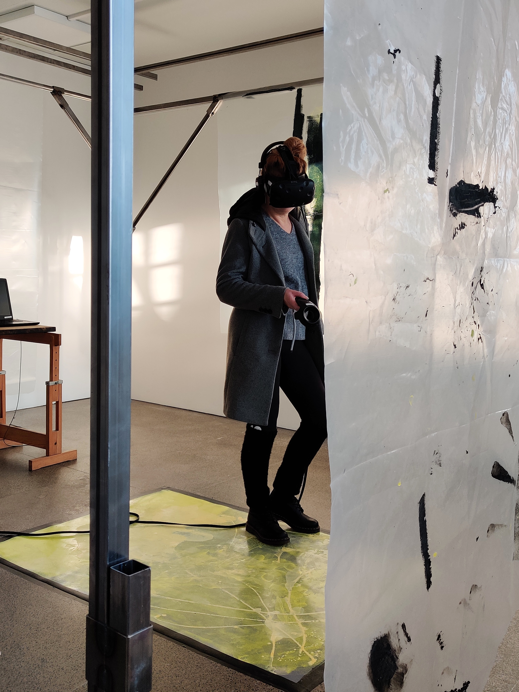
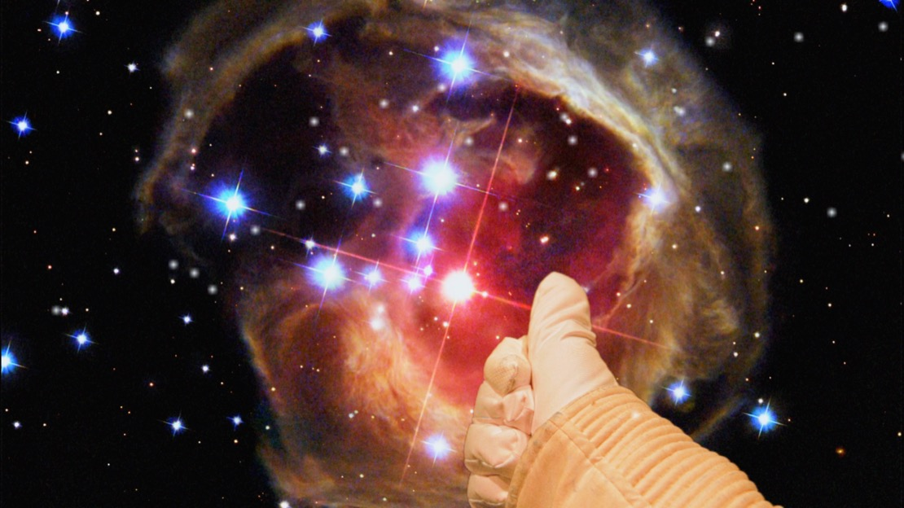

## Making Art In My Dreams 

The animated VR-documentary Making Art In My Dreams is now complete! It will be exhibited for the audience in [Chappe, Art House By The Sea, at Tammisaari 24.5–15.9.2024](https://chappe.fi/en/exhibition/making-art-in-my-dreams-2/).

What do artists dream about? Repressed androids, panthers in trees, walking mushrooms - their work. For some people, dreams are a shortcut to creativity. Follow a theremin player, a poet and a visual artist on a wild ride in creative subconscious!

Making Art In My Dreams is an animated documentary experience featuring three ambitious artists, Arina Baranova, Dorina Owindi and Susanna Viljanmaa. In virtual reality, almost like in someone else’s dream!

{: .img-fluid}

{: .img-fluid}

{: .img-fluid}

Chappe photos: Ahmed Alalousi

{: .img-fluid}

{: .img-fluid}

{: .img-fluid}

|   |   |
|---|---|
| Written and directed by: | Leena Jääskeläinen |
| Producer: | Marko Tandefelt |
| Content: | Baranova, Owindi, and Viljanmaa |
| Programming: | Alex Savander |
| Animated by: | Susanna Viljanmaa, Kristina Laine |
| Sound Design: | Janne Laine |
| Installation: | Marja Zilcher |
| Production company: | Animaatiokopla |

With kind support from Finnish Film Foundation, AVEK, Aalto Digital Creatives and Finnish Heritage Agency

## Making Art In My Dreams - A Sneak Peek

In virtual reality, almost like in someone else’s dream!

A Sneak-Peek of the animated VR-documentary was available at Oodi Kuutio November 24th – December 7th 2022 after which we entered the production stage.

{: .img-fluid}

{: .img-fluid}

<iframe src="https://player.vimeo.com/video/796657438?h=05fabe0811&amp;badge=0&amp;autopause=0&amp;player_id=0&amp;app_id=58479" width="554" height="640" frameborder="0" allow="autoplay; fullscreen; picture-in-picture" allowfullscreen title="Making Art In My Dreams preview"></iframe>

The documentary features three talented artists from different fields.

Arina Baranova is at the beginning of her career as a visual and performance artist. She has had periods of time, when she bases all of her drawings on her dreams. Sometimes, if she feels stuck with a picture, she takes a break, and sees a solution the next night.

Susanna Viljanmaa is truly a multitalent! She’s a theremin player and a composer of electronic music, she also does illustrations, and is a skilled 3D-modeller. Susanna’s dreams are filled with sounds and tunes, and she incorporates them in her music.

Donna Owindi is a writer, poet and natural healer. She believes that dreams teach valuable lessons, and it is important to remember them. That is one reason she keeps a dream diary. The other one is that she feels dream journaling helps her artistry.

|   |   |
|---|---|
| Written and directed by: | Leena Jääskeläinen |
| Producer: | Marko Tandefelt |
| Content: | Baranova, Owindi, and Viljanmaa |
| Programming: | Alex Savander |
| Sound Design: | Janne Laine |
| Production company: | Animaatiokopla |

## Virtual Reality experience, in development 2022

Making Art In My Dreams will feature artists from different fields, presenting them in wildly illustrated scenarios. At the core is the relationship between creative work and dreaming.
Artists both dream about their projects, and base their work on their dreams. Within this art work,  each  artist will have their own individual dreamworld, to reflect the dreamers personality, and artistic work.
When completed, this experience will be almost like seeing someone else's dreams in VR. And on top of that, have fun and play!

<iframe src="https://player.vimeo.com/video/463022706?h=05fabe0811&amp;badge=0&amp;autopause=0&amp;player_id=0&amp;app_id=58479" width="640" height="360" frameborder="0" allow="autoplay; fullscreen; picture-in-picture" allowfullscreen title="Making Art In My Dreams -teaser"></iframe>

Currently Making Art In My Dreams is at the development stage. It made history by landing development support from the Finnish Film Foundation, as the first VR-project ever. Earlier Making Art In My Dreams has received funding from AVEK, the Promotion Centre for Audiovisual Culture. A demo-version is available for OculusQuest and HTC Vive.
The project also took part in the prestigious Anidox:LAB in 2020.

## Paranormal Phenomena, revisited

Virtual Reality installation, 2020/2021

An improved version of Paranormal Phenomena was exhibited in the atmospheric Pesula Gallery in Sipoo on January 2021. The opening was cancelled due to a snow storm, but exhibition was a succes nonetheless, providing lots of visitors with a first experience in virtual reality.
Since the previous exhibition the user interface had been slightly improved, and  people's stories were presented also as text in addition to audio. This was done to improve accessibility.
Paranormal Phenomena exhibition at Pesula Gallery also included new augmented reality elements by Auli Nikkanen.

{: .img-fluid}

Poster image, Paranormal Phenomena.

{: .img-fluid}

{: .img-fluid}

## Paranormal Phenomena
Virtual reality installation, 2020

{: .img-fluid}

<iframe src="https://player.vimeo.com/video/402864173" width="640" height="432" frameborder="0" allow="autoplay; fullscreen" allowfullscreen></iframe>

PARANORMAL PHENOMENA was exhibited in the Helsinki MUU Cable gallery from February 28th to March the 17th. Unfortunately the exhibition time was cut short because of the COVID-19 pandemic.

Paranormal Phenomena consists of three parts, each to be experienced in virtual reality. In the artwork interviews of people are combined with a strange, dreamlike environment. The thirteen people who were interviewed spoke about their feelings of love or rage, about strong body dysmorphia and deep satisfaction with themselves. Emotions, physicality and body are central.

Each part of the artwork is a world of it’s own, with the stories attached to different elements. The esthetics of the artwork is derived from the airbrushed 80’s scifi visions. Living spaceships, glass fibre rocks and pulsating crystals. It was important to me to make the worlds approachable by adding some hand-crafted feel and humour. I knew that for the majority of the gallery-goers Paranormal Phenomena would be their first time in virtual reality, so I wanted to make sure the experience is warm and non-threatening.

The first part, OUT OF BODY EXPERIENCE deals with body image and issues. It’s environment is something like a candy-colored outer space. The atmosphere, depending on the story, can be either melancholic or cheerful. An earlier version of this piece was seen in Kotka Art 2018.

{: .img-fluid}

Part two,  SPONTANEOUS COMBUSTION is about strong inflammable emotions. Rage, love, wish for death. It is a cave, echoing of mysterious tunes and voices. Hidden in a ruby-crystal chamber, a powerful, personal poem by Dorina Owindi can be found.

{: .img-fluid}

The third part, MIND OVER MATTER voices out extreme experiences. What is difficult for the body? What about the mind? The landscape of this part is a bottom of the sea on another planet, with alien plant life. The stories of interviewed people swim in deep waters at times.

{: .img-fluid}

For the exhibition at MUU Cable the gallery space was divided into four parts by a custom made steel frame. Recycled transparent acrylic, carpeting and tarpaulin, were hung from the frame. The colors were neutral; black, grey, wood, steel and dirty white. This aimed both to create a contrast between the somewhat dreary gallery space and the vividly colorful virtual space, and to give some privacy to people using VR-glasses.

The elements of the virtual worlds of Paranormal Phenomena were sculpted in MasterpieceVR, animated in Blender and programmed in Unity. At the gallery there were three sets of OculusQuest and one set of HTCVive.

Directed, written and designed by Leena Jääskeläinen; sound design by Janne Laine; programming, animating and compositing by Alex Savander; additional programming by Johannes Päivinen; additional animating by Auli Nikkanen; exhibition structures by Marja Zilcher.

{: .img-fluid}

{: .img-fluid}

{: .img-fluid}

## Out Of Body Experience

Virtual art work, 2018

*Out of Body Experience* is an art work to be experienced in a virtual
reality environment. It combines interviews about body image to an
abstract, dreamlike landscape created in a 3D-program. The result is
intimate, atmospheric and meditational. In virtual reality, one doesn\'t
in a sense have a body. *Out of Body Experience* utilizes this feeling
of detachment.

*Out of Body Experience* was exhibited as a part of Kotka Art annual art show during the summer of 2018 in Kotka. The art work provided many art show guests with a first time experience of virtual reality as a technology, and was very well received.

> My body causes some confusion in people. They are thinking whether I'm male or female, and sometimes they try to harrass me or mock me, or misgender me on purpose.

> My real body is my skeleton.

> When I was thin, it was so important to me, that I once said that I'd rather be dead than fat. I meant it. A little embarrasing now.

> I really wanna have a mustache. God damn, gosh darn, I love mustaches, but I can't have it, cause I have only like a few dark hairs above my lip, and that's it!

Written, directed and designed by Leena Jääskeläinen

Animation and modelling by Auli Nikkanen

Coding by Johannes Päivinen

Sound design by Janne Laine

{: .img-fluid}

{: .img-fluid}

{: .img-fluid}

{: .img-fluid}

## Blue sky on Mars

Experimental animation documentary, 2018

Scientist Sini Merikallio talks about science fiction in the
experimental documentary *Blue sky on Mars.*

The basis for this film was the curiosity about scientists\' view on
science fiction. What do people, who invent electric solar wind sails, use
satellites to measure Earths gravitational field, monitor marine
environment using 500 000 observations per day, or design greenhouses on
Mars, think about science fiction? *Blue sky on Mars* invited four scientists from different fields to talk
about science fiction. And not just talk, to also create experimental
animation art inspired by it. Various animation techniques were used in
a series of workshops. Stop motion was filmed at the roof of the
Meteorological Institute, and in the Helsinki zoo, cut-outs were
animated in a studio, rockets were drawn with markers on transparent
plastic in a greenhouse, et cetera. The results were pretty amazing. It
turned out that the scientific mind is also very adept in creating
animation!

Of the four parts envisioned, one is completed so far. The rest remain
in pre-production for the time being.

Participating scientists: Sini Merikallio, Olli Wilkman, Simo Siiriä,
Lauri Neuvonen.

<https://vimeo.com/249516336>

Password: blue

{: .img-fluid}

{: .img-fluid}

{: .img-fluid}

{: .img-fluid}

## Building Art History

Experimental documentary, 2017

*Building Art History* is an experimental documentary film about the
ideal body throughout history. In ancient Greece athletes were carved
out of marble, in the times of renaissance fabulous frescos were
painted, nowadays it\'s all about building one\'s own body. And posing!

*Building Art History* features five body builders posing the same way
as people in the art works of their choosing. Before going into the
shooting part of the process, there were interesting talks about ideals,
motives, society, and art. Being in the shape for contests is hard work,
and feels even painful. One of the participants wanted to concentrate on
this feeling of suffering in his part of the film, and chose the art
works accordingly. The other wanted to convey power and self assurance.
The beauty ideals now are very much the same as they were in ancient
Greece. Many of the poses of classical body building can be seen in
classical statues. The female body builders today face the similar
criticism as Michelangelo\'s female figures way back; they are labeled
ugly and masculine.

*Building Art History* was shot in the location of different gyms, to
show the participants in an environment that is natural to them, where
they spend a lot of time in.

People on the film: Eppu Saarela, Nasim Nasu Shamlou-Juhola, Moms Bah,
Bettina Gräsbeck and Hans Rohila.

<iframe src="https://player.vimeo.com/video/245196217" width="640" height="360" frameborder="0" webkitallowfullscreen mozallowfullscreen allowfullscreen></iframe>

{: .img-fluid}

{: .img-fluid}

{: .img-fluid}

{: .img-fluid}

{: .img-fluid}

## Contact!

Experimental animation film, 2017

*Contact!* is an experimental animation film about movement and meeting.
It explores differences and similarities between dancing and martial
arts aikido and judo. The technique is hand painted digital animation.
*Contact!* was originally an installation piece, with three separate
looping parts, each projected on a tar-paper surface in a gallery. Later
the material was edited into a short film, with addition of music by
Nikolai Kleiman. The editing of the film follows the rhythm of the music
very closely, it even required some additional animation.

There is something very soothing, hypnotic even, in watching looping
movement. One gets to enjoy the fast pace, but is able to actually see
clearly what is going on.

In the heart of *Contact!* is the meeting, the interaction between two
people. In judo it seems violent, but is it really? The attack is
simulated. There is no real intent of harming the opponent. Both the
attacker and the attacked know how to move and how to fall. The
situation is safe. In the dance sequence the meeting is joyous, even
loving, eventhough the steps are well rehearsed. There is no attack, no
defense. But there is definitely a reaction! In the part with aikido the
roles of the attacker and the attacked keep changing. Both keep
themselves very soft and react to each others movement. On the surface,
this comes very close to dancing, but on the inside it is similar to
judo. Best of both worlds? It might not be just a coincidence, that both
the director and the musical composer of this film hold a black belt in
aikido!

<iframe src="https://player.vimeo.com/video/214458568?loop=1" width="640" height="360" frameborder="0" webkitallowfullscreen mozallowfullscreen allowfullscreen></iframe>

{: .img-fluid}

{: .img-fluid}

{: .img-fluid}

## In love with Amelia Earhart

Animation short film, 2014

*In love with Amelia Earhart* is a light-hearted short film about the
contradiction between youthful enthusiasm and mature realism. In the
film the middle-aged Erja is reunited with her two lost loves; Amelia
Earhart and herself.

In the film the historical heroine Amelia Earhart is a symbol of freedom
and courage to pursue one\'s dreams. The flip-side of a dream of flying
is the fear of falling, of course. The middle-aged version of the main
character Erja has had her share of falling, something the teenage
version of her is yet blissfully ignorant of. *In love with Amelia
Earhart* features footage of Amelia Earhart\'s last flight. The old
black and white clips were hand painted on to create a feeling of
subjectivity; the person watching these clips is Erja.

The stop motion sequences of this film were shot in the beautiful
Brinkhall mansion in the archipelago of Turku. The mansion provided
amazing details to the film; chipped paint, water-stained parquet
floors, rust. Hand-held pico projectors were used to illustrate the
thoughts of the main characters.

The two versions of Erja are acted by the mother-daughter duo Taina
Nyström and Rosita Manninen. The differences and similarities of Erjas
are clearly seen in the high point of the film, the dance scene. The
middle-aged Erja is precise and sure, the young Erja is a little clumsy
but energetic. Both filled with joy and happiness in the end.

<iframe src="https://player.vimeo.com/video/98132313" width="640" height="350" frameborder="0" webkitallowfullscreen mozallowfullscreen allowfullscreen></iframe>

{: .img-fluid}

{: .img-fluid}

{: .img-fluid}

{: .img-fluid}
